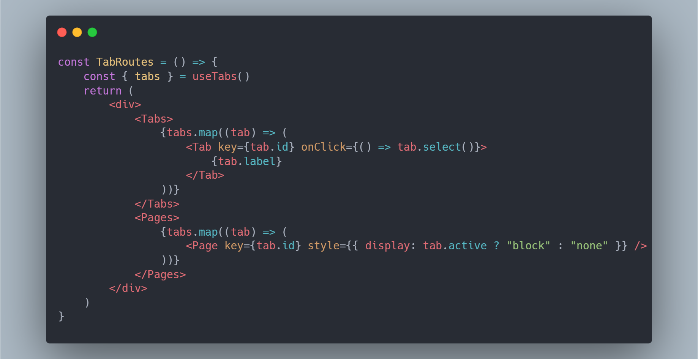

# React Transport，真正的穿梭，真正的Keep-Alive

众所周知，得益于React的Fiber架构和[链式的State](https://dev.to/wuz/linked-lists-in-the-wild-react-hooks-3ep8)... 啊不，官方没有实现`KeepAlive`并丢给你一个[需求较偏](https://github.com/facebook/react/issues/12039#issuecomment-411621949)的理由，在遇到此需求时，我们需要自己实现一个。

有一说一，即便是SPA应用，缓存组件（甚至页面路由）状态并没有足够的需求。从Vue和React出色的性能来说，将路由整体囊括缓存实在是过于简单粗暴且没有必要。

废话之后是**需求背景**：

需求就像老板脑子里的水，挤一挤总归是能出来的 —— 鲁迅。

在某个需求中，我们需要实现一个页面内的tab路由，这些tab的已渲染的内容不能销毁，方便**丝滑切换**和**页面状态缓存**（甚至是scrollbar的位置）。简而代码之，如下：

可以看到，里面最蛋疼的点是tab页面都没销毁，只是`display:none`掉，因此会造成性能问题。无独有偶，著名的Python笔记工具Jupyter NoteBook[也有此问题](https://github.com/jupyterlab/jupyterlab/issues/4292)

除了[ShadowDOM](https://developer.mozilla.org/en-US/docs/Web/API/Web_components/Using_shadow_DOM)、使用绝对定位布局的vscode这些方式外，就是一行css代码就能解决的[CSS属性:  contain, Chrome>52 Safari>15.4 Firefox>69](https://developer.mozilla.org/en-US/docs/Web/CSS/contain)

> providing performance benefits by limiting calculations of layout, style, paint, size, or any combination to a DOM subtree rather than the entire page
>
> 通过划定渲染和影响范围来提升性能

虽然`contain: strict`带来了性能提升，但是也带来了一个问题：若某元素A使用了此CSS，fixed定位的子元素将被限制在元素A的范围内。

“机智的我”根本没注意到这个问题，开心实现后发现，原来通过fixed全屏元素的功能都出现了问题（别问我为啥不用[Element: requestFullscreen() Chrome > 71](https://developer.mozilla.org/en-US/docs/Web/API/Element/requestFullscreen)，问就是数学问题， 71 > 66）

“又机智的我”发现，这，简单，React直接将此Portal到body就行了，如果是单个页面portal出去，性能没有问题。

不出意外的话，意外就来了。portal操作将组件从A切换到body后，页面造成了刷新，tab页面内的状态丢失了。这可糟糕了，虽然性能解决了，但是用户体验下来了。而这个Tab又有不得不这样做的理由（甚至tab后面直接用了JupyterLab desktop同款布局组件[lumino](https://lumino.readthedocs.io/en/latest/examples/dockpanel/index.html)）。

**虽然鲁迅这样说了，但是作为富有责任心的我们，需要客服一切困难，实现老板的梦想**

## 为什么状态保不住？

